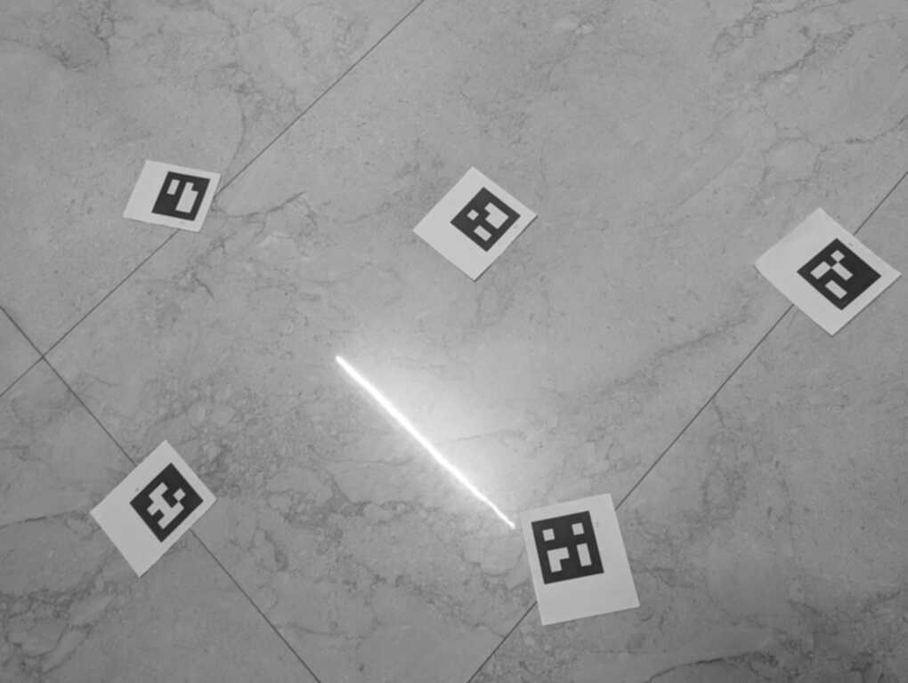
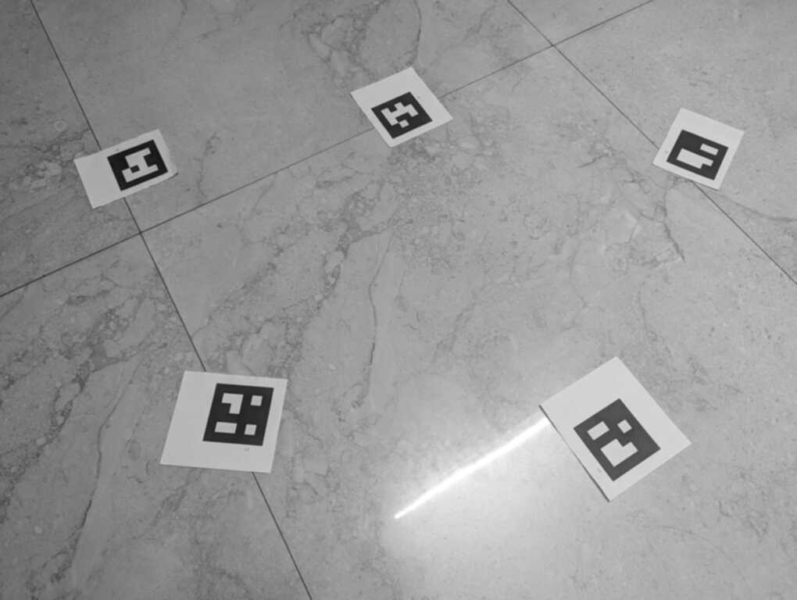
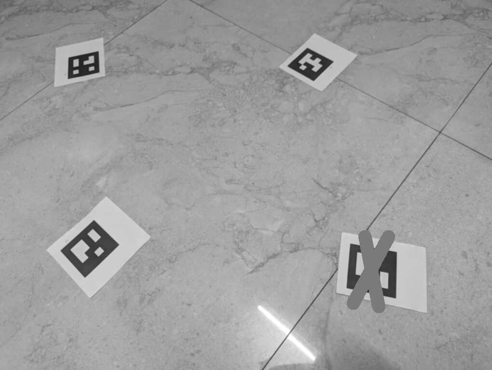
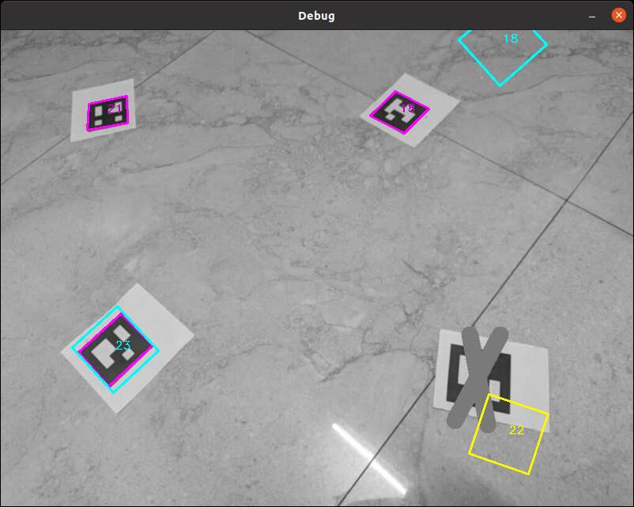
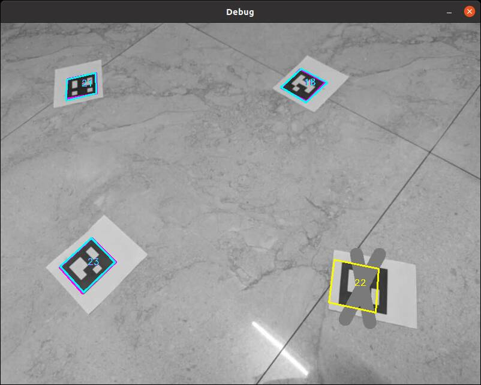

## About
This is a simple project that localizes capture device (camera), Aruco tags in 3D, and camera params (focal length) using multiple image captures.
All captures are assumed to by made with same camera, and all Aruco tags are assumed to be the same size.

Once capture parameters knowns and saved into a map, any new capture can be localized (more quickly) against that map.
A saved map can also be updated or extended with more captures.

Currently there is only 2D debug visualization of results using OpenCV.

## Usage

### Generate AR tags
Generate multiple PNG files Aruco tags arranged to be printed as 8.5x11 pages.
The images can be imported into a google doc and then be printe out with 100% scaling.
The Aruco dictionary that is used should produce 50 unique tags that are placed in a 2x3 grid on 9 images.
```
./ar_gen
```
### Generate Map
Compute a map from from a bunch of images of AR tags from different angles.
At least two AR tags should be visible in a single image.
Capture should have overlapping tags produce a connected graph of captures and AR tags.
The tool will automatically produce the output map.yaml
```
./ar_slam image*.jpg
```

### Localize
With a known map a different capture can be localized aganist the existing map.
```
./ar_loc map.yaml image.jpg
```

## Example

### Generate Map
In this example 3 captures of 6 different AR tags are used to make a map.

```
./ar_slam images/img1.jpg images/img2.jpg images/img3.jpg
```




### Localize
Then a forth image is localized against the map.  The forth image is modified so AR-tag is partially occluded so it is not dectected.
For each capture two debug screens are shown.  The first shows the projected outlines before optimization is performed.
The second screen shows results after optimization.
```
./ar_loc map.yaml image.jpg
```

Debugging output showing annotated positions pre-optimization


Debugging output showing annotated positions post-optimization


When localizing the debug display shows an image showing where the tags are detected and map tags are projected.
Tags that were not detected will be outlined in yellow.
- magenta : Aruco detections in capture
- cyan : projected AR-tags based on map and localized capture pose (for detected tags)
- yellow : projected AR-tags based on map and localized capture pose (for undetected tags)


## Build
Tested on Ubuntu 20.04

Need following dev packags installed
- libceres-dev
- libopencv-dev
- libeigen3-dev

First generate makefiles with CMake
```
cmake .
```

Then build with make
```
make
```
