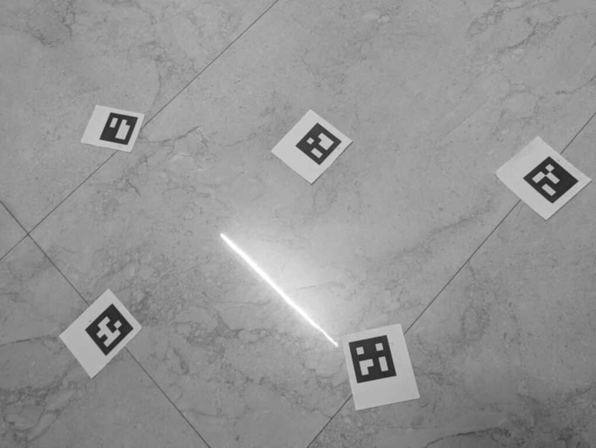
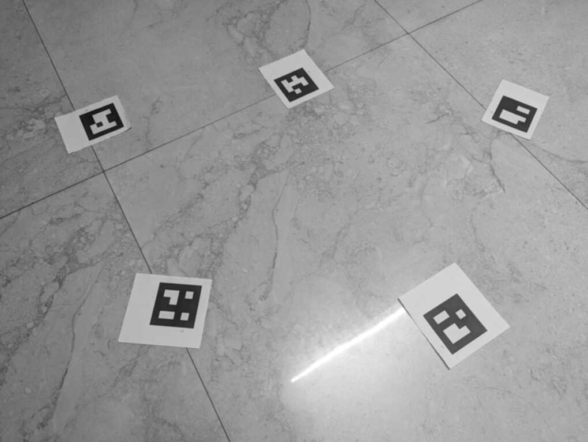
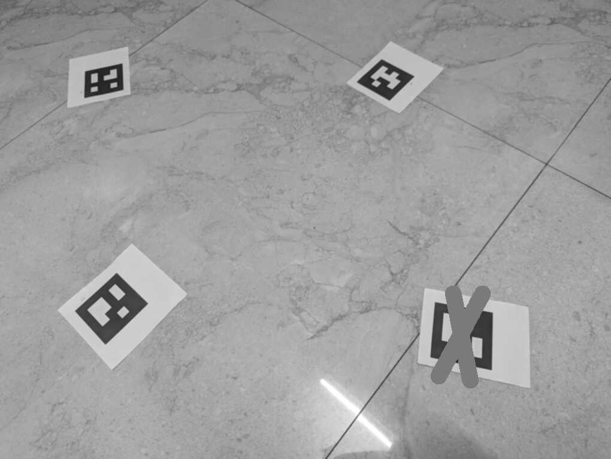
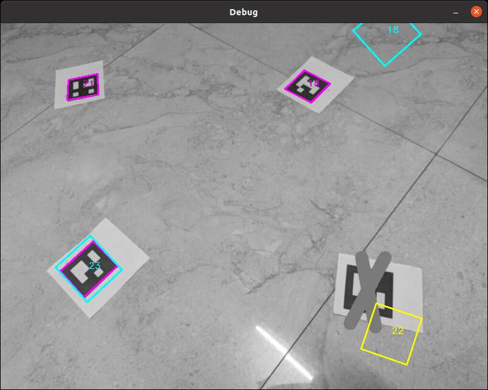
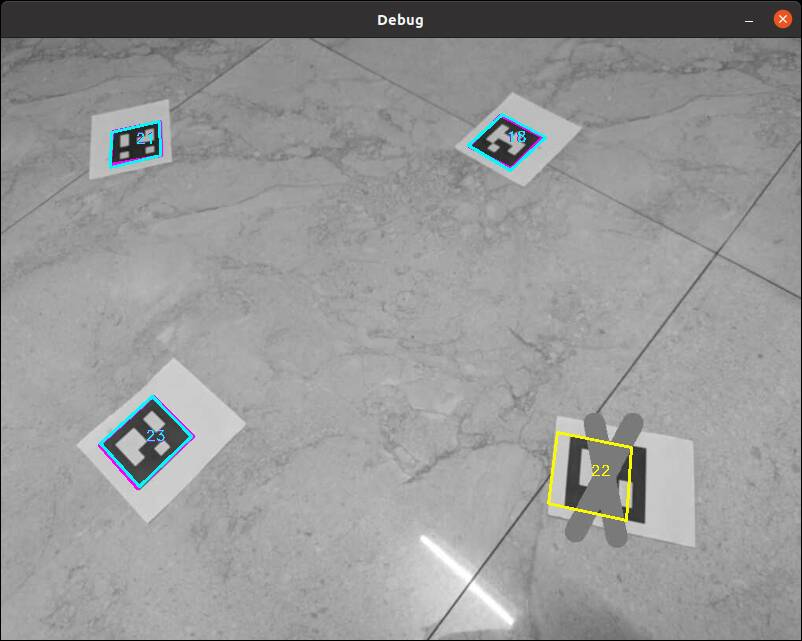

## About
This project uses multiple image captures to compute relevant camera parameters and AR tags poses.
All captures are assumed to by made with the same camera, and all AR tags are assumed to be the same size.

Capture parameters are computed and saved as map.  New captures can be localized against that map.
A saved map can also be updated or extended with more captures.

Currently there is only basic 2D visualization of results.
## Usage

### Generate AR tags
The ar_gen tool can generate multiple PNG files containing a set of Aruco tags.
The images can be imported into a Google doc and then be printed out on 8.5x11 paper with 100% scaling.
The  Aruco_4x4_50 dictionary should produce 50 unique tags that are placed in a 2x3 grid on 9 images.
```
ros2 run ar_slam ar_gen
```

### Generate Map
Compute a map from from a bunch of images of AR tags from different angles.

At least two AR tags should be visible in a single image.
Captures should have overlapping tags produce a connected graph of captures and AR tags.
The tool will automatically produce the output file /tmp/map.yaml
```
ros2 launch ar_slam ar_slam_launch.py
```

Use a CLI tool to make ROS2 service call for slam stack to process certain files from disk.
Multiple calls can be used to incrementally build up map.
```
ros2 run ar_slam load_images_client img1.jpg img2.jpg ...
```


### Localize
With a known map, a new capture can be localized aganist the existing map.
```
ros2 run ar_slam ar_loc /tmp/map.yaml ar_slam/resources/images/img4.jpg
```

## Example

### Generate Map
In this example 3 captures of 6 different AR tags are used to make a map.
The images used for the example are located in the directory ar_slam/resources/images.

demo.launch has been hard-coded to run the ar_slam ROS container.  It will then invoke a service call that requests 3 images to be processed : img1.jpg, img2.jpg, and img3.jpg;
```
ros2 launch ar_slam demo_launch.py
```




While SLAM is running, it will produce a debugging GUI window showing the results before and after optimization is run for each capture.

When demo is complete, it will automatically exit after a timeout and save "map.yaml" to the /tmp directory.

### Localize
A forth image is localized against the saved map.  The image is modified so one AR-tag is partially occluded and is not detected.
```
ros2 run ar_slam ar_loc /tmp/map.yaml images/img4.jpg
```

For each capture two debug screens are shown.  The first shows the projected outlines before optimization is performed. The second screen shows results after optimization.

Debugging output showing annotated positions pre-optimization


Debugging output showing annotated positions post-optimization


When localizing, a debug GUI shows where the tags were detected and projected after localizing
Tags that were not detected will be outlined in yellow.
- magenta : Aruco detections in capture
- cyan : projected AR-tags based on map and localized capture pose (for detected tags)
- yellow : projected AR-tags based on map and localized capture pose (for undetected tags)

## Design
The application leverages ROS2, Ceres, and OpenCV.
Most of the different components are implemented as ROS2 components.  The components form a data pipeline line with the following stages:
 1. Load:  Loads JPG from disk and converts it into an uncompressed image
 2. Detect:  Image capture is searched for Aruco markers.  Multiple components can be run in parallel on same image looking for different  markers types.  Default setup looks for both 4x4_50 and 5X5_100 types.
 3. Merge:  Different detector outputs are merged into a single message that contains all the detections for a single detector.
 4. SLAM:  Detections from different captures connected together by common AR-tags.  These captures and AR-tags form an connected graph of constraints.  The Ceres non-linear solver is used to estimate the "best-fit" for poses and camera intrinsics.

```
                     +-----------+
                     |           |
                     | 4x4 Aruco |
 +--------+     +--->| Detector  |--
 |        |     |    |           |  \     +-------+    +------+
 | Image  |     |    +-----------+   \    |       |    |      |
 | Loader |-----+                     +-->| Merge |--->| SLAM |
 |        |     |    +-----------+   /    |       |    |      |
 +--------+     |    |           |  /     +-------+    +------+
                +----| 5x5 Aruco |--
                     | Detector  |
                     |           |
                     +-----------+
```

### Performance ###
A few things are done to improve performance.
 - A multi-threaded container is used allowing multiple component callbacks to be run in parallel.
 - Intra-process message passing is enabled.  Internal ROS messages are passes around using unique are shared pointers instead of being serialized and deserialized.


## Build
Tested on Ubuntu 22.04 and ROS2 Iron Irwini

Use perception install to get most dependencies
```
docker pull ros:iron-perception-jammy
```

Need extra ceres dev packages installed:
```
sudo apt update
sudo apt install -y libceres-dev
```

```
colcon build --packages-select ar_slam_interfaces ar_slam --cmake-args -DCMAKE_BUILD_TYPE=RelWithDebInfo
```
